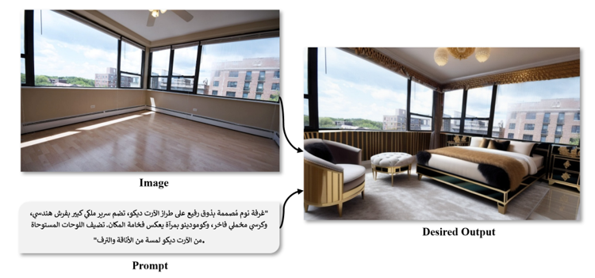

# AI Design Tool

A web-based tool that lets users redesign interior spaces. Users can upload a room photo and write a prompt in Arabic, and the tool generates a new interior design while preserving the room layout, including inpainting windows and doors.

---

## Features

* Upload a room photo and describe the desired style in Arabic.
* Generates realistic interior designs without changing room layout.
* Preserves windows, doors, and other structural elements.
* Supports color changes, texture replacements, and style adaptations.

---

## How It Works

1. **Data Collection & Preprocessing**

   * Scraped images from Airbnb.
   * Generated “before” images from “after” images using a generative model.
   * Used a Visual Question Answering (VQA) model for automatic annotation.
   * Translated Arabic user input to English before feeding it to the model.

2. **Model Pipeline**

   * **Stable Diffusion**: Generates styled room images.
   * **ControlNet**: Maintains layout using segmentation and depth estimation.
   * **Segmentation**: Identifies walls, floors, ceilings, windows, and doors.

3. **Fine-Tuning**

   * LoRA applied on top of Stable Diffusion to teach the model specific interior design styles efficiently.

4. **Deployment**

   * Deployed on Azure for public access.
   * FastAPI backend with Uvicorn server.
   * Dockerized for easy deployment and scalability.

---

## Technologies Used

* Python 3.12
* HuggingFace Transformers & Diffusion Models
* Stable Diffusion + ControlNet + LoRA
* Visual Question Answering (VQA)
* FastAPI + Uvicorn
* Docker
* Azure App Service

